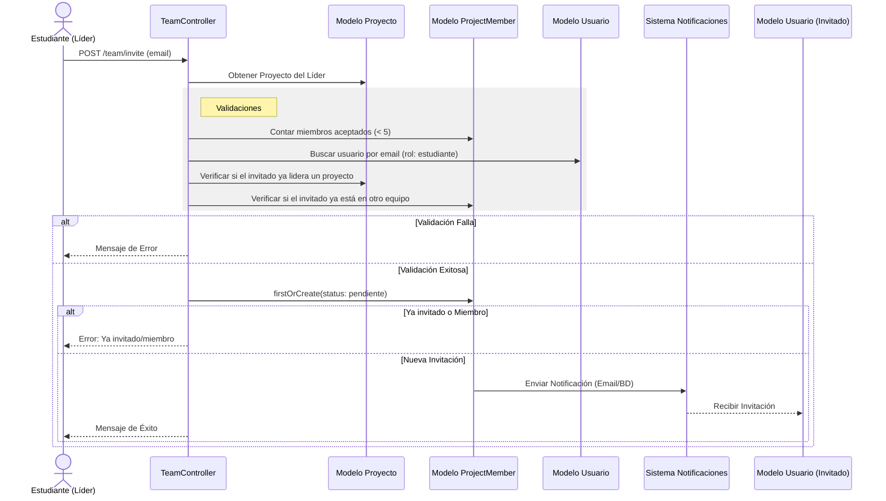
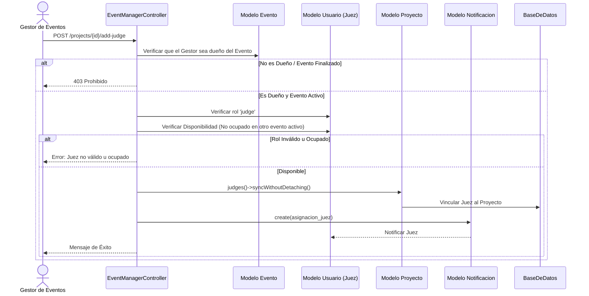
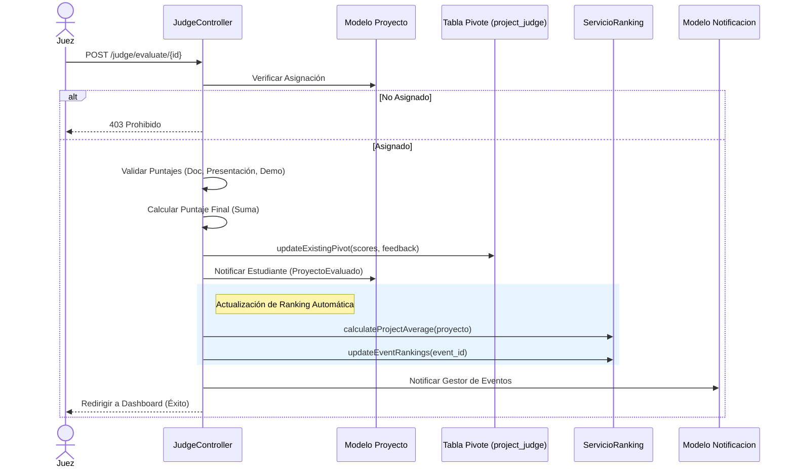

# WebAtoon - Sistema de Gestión de Eventos Académicos

WebAtoon es una plataforma integral diseñada para la administración, inscripción y evaluación de proyectos en eventos académicos (como ferias de ciencias, exposiciones de ingeniería, hackathons, etc.).

## Características Principales

- **Gestión de Eventos**: Creación y administración de múltiples eventos simultáneos.
- **Roles y Permisos**: Sistema robusto con roles diferenciados (Admin, Gestor, Juez, Asesor, Estudiante).
- **Inscripción de Proyectos**: Los estudiantes pueden inscribir sus proyectos, seleccionar asesores y subir entregables.
- **Evaluación Digital**: Los jueces asignados pueden evaluar proyectos y dar feedback directamente en la plataforma.
- **Notificaciones**: Sistema de alertas para mantener informados a todos los usuarios sobre cambios importantes.
- **Certificados**: Generación de constancias de participación (Próximamente).

## Estructura del Proyecto

El sistema está construido sobre **Laravel 11** y sigue una arquitectura MVC clásica.

### Roles del Sistema
1.  **Administrador (Admin)**: Control total del sistema. Crea usuarios y eventos.
2.  **Gestor de Eventos (Event Manager)**: Responsable de la logística de un evento específico. Aprueba proyectos y asigna jueces.
3.  **Juez (Judge)**: Experto invitado que evalúa los proyectos asignados.
4.  **Asesor (Advisor)**: Profesor o mentor que guía a los estudiantes.
5.  **Estudiante (Student)**: Participante que inscribe proyectos y sube avances.

### Módulos Clave
-   **Auth**: Registro y autenticación segura.
-   **Proyectos**: CRUD completo de proyectos con estados (Pendiente, Aprobado, Rechazado).
-   **Entregables**: Carga y descarga de archivos (PDF, ZIP) para evidenciar el progreso.
-   **Evaluaciones**: Formulario de calificación con puntaje y retroalimentación.

## Instalación y Configuración

Para configurar el proyecto automáticamente, sigue estos pasos:

1. Clonar el repositorio:
   ```bash
   git clone https://github.com/HFernandoCR/WebAtoon.git
   cd WebAtoon
   ```

2. Ejecutar el script de configuración:

   **Windows:**
   Haz doble clic en `setup.bat` o ejecuta en la terminal:
   ```cmd
   setup.bat
   ```

   **Linux / Mac:**
   ```bash
   chmod +x setup.sh
   ./setup.sh
   ```

   *Este script instalará dependencias (PHP/Node), configurará el `.env`, generará la key, configurará la base de datos y correrá las migraciones.*

3. **Usuarios de Prueba**:
   Para poblar la base de datos con usuarios de prueba para cada rol, ejecuta:
   ```bash
   php artisan tinker
   include 'create_test_users.php';
   ```

## Tecnologías

-   **Backend**: Laravel 11, PHP 8.2+
-   **Frontend**: Blade Templates, TailwindCSS (vía Vite)
-   **Base de Datos**: MySQL
-   **Control de Versiones**: Git

  ## Diagrama de Secuencias
  ```mermaid
sequenceDiagram
    actor Estudiante
    participant ProjectController
    participant Modelo Evento
    participant Modelo Proyecto
    participant Modelo Notificacion
    participant BaseDeDatos

    Estudiante->>ProjectController: POST /projects (store)
    
    ProjectController->>Modelo Proyecto: Verificar si ya tiene proyecto activo
    alt Ya tiene proyecto activo
        ProjectController-->>Estudiante: Error: Ya tienes un proyecto en curso
    else No tiene proyecto activo
        ProjectController->>Modelo Evento: findOrFail(event_id)
        Modelo Evento-->>ProjectController: Datos del Evento
        
        ProjectController->>ProjectController: Validar Fecha y Estado (Inscripciones abiertas)
        
        alt Fecha/Estado Inválido
            ProjectController-->>Estudiante: Error: El evento no está activo
        else Evento Válido
            ProjectController->>Modelo Proyecto: create(datos)
            Modelo Proyecto->>BaseDeDatos: Insertar Proyecto
            BaseDeDatos-->>Modelo Proyecto: Proyecto Creado
            
            par Notificar Gestor de Eventos
                ProjectController->>Modelo Notificacion: create(nuevo_proyecto_registrado)
            and Notificar Asesor (si fue seleccionado)
                ProjectController->>Modelo Notificacion: create(asesor_asignado)
            and Notificar Administradores
                ProjectController->>Modelo Notificacion: create(nuevo_proyecto)
            end
            
            ProjectController-->>Estudiante: Redirigir a Índice (Éxito)
        end
    end
```
2. Estudiante: Invitar Miembro al Equipo

3. Gestor de Eventos: Asignar Juez

4. Juez: Evaluar Proyecto


---
© 2025 WebAtoon. Todos los derechos reservados.
